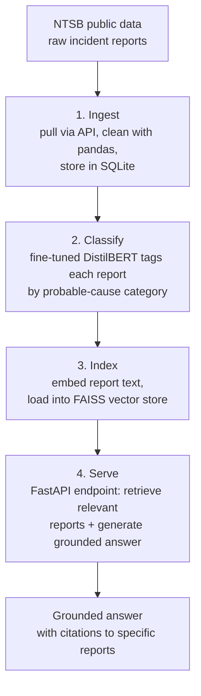

# aviation-incident-intel

An NLP pipeline that ingests, classifies, and semantically searches NTSB
aviation incident reports — turning thousands of inconsistent, narrative-heavy
government documents into a searchable system that answers plain-English
questions with citations to specific reports.

> **Status:** In active development. Setup and project scaffolding complete;
> ingest stage in progress. See [Roadmap](#roadmap) for current scope.

## The problem

The NTSB publishes thousands of aviation incident and accident reports. They
are long, inconsistently structured, and difficult to search — there is no good
way to ask a question like *"show me incidents involving fuel system failures in
small aircraft since 2020"* and get a grounded, cited answer. This project builds
the tool that makes that question answerable.

## Architecture



Each stage's output is the next stage's input, so the stages are independently
testable: ingest produces a clean database, classify adds labels to it, index
builds a vector store from it, and serve reads what's already there.

## Tech stack

**Language & tooling:** Python 3.12+, uv, pytest, Git
**Data & ingestion:** NTSB public API, pandas, SQLite
**ML & NLP:** PyTorch, HuggingFace Transformers (DistilBERT), scikit-learn, MLflow
**Search & retrieval:** sentence-transformers, FAISS, RAG
**Serving & deployment:** FastAPI, Docker

## Roadmap

- [x] Project scaffolding and packaging (uv, src layout)
- [ ] **Ingest** — pull NTSB reports, clean with pandas, store in SQLite
- [ ] **Classify** — fine-tune DistilBERT to tag reports by probable-cause category
- [ ] **Index** — embed reports into a FAISS vector store
- [ ] **Serve** — FastAPI RAG endpoint returning grounded, cited answers
- [ ] **Package** — Dockerize, single-command `docker-compose up`

## Setup

```bash
uv sync
uv run python -m ntsb_intel.ingest
```

_(Requires [uv](https://docs.astral.sh/uv/). Keep the project in a path without
spaces.)_